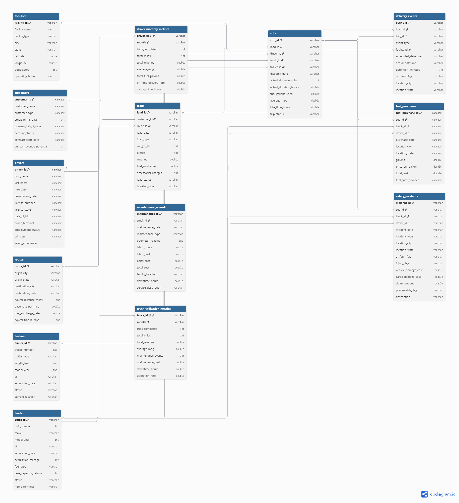

# BlueLine Logistics Operational Performance Analysis

An end-to-end SQL and Power BI project that analyzed logistics operations to uncover opportunities for improving profitability, reducing operating costs, and strengthening fleet performance through data-driven decision making.

---

## ⚙️ Project Type Flags
✅ SQL Analysis / Querying

✅ Dashboard / Data Visualization

✅ Data Cleaning / Wrangling

✅ End-to-End Analytics Project 

---

## Table of Contents

1. Project Overview
2. Project Objectives
3. Project Scope & Tools
4. Data Workflow
5. ERD (Entity Relationship Diagram)
6. Analysis & Metrics
7. Key Insights
8. Recommendations
9. Assumptions & Limitations
10. Author

---

## Project Overview

### Context

BlueLine Logistics is a regional freight transportation company responsible for moving goods across multiple routes using a fleet of trucks, trailers, and drivers. Although the company generates substantial revenue, management lacks a centralized view of operational performance. Rising fuel expenses, maintenance costs, and safety claims make it difficult to understand which areas of the business are driving profitability and which are quietly increasing operational costs.

To support better decision-making, management needs an analytical solution that combines financial, operational, fleet, customer, and safety data into one reporting environment.

### Problem Statement

The operations team needed to answer several business-critical questions:

- Which customers and transportation routes generate the most revenue?
- How much is being spent on fuel and maintenance across the fleet?
- Which trucks contribute most to downtime?
- Are certain drivers responsible for disproportionately high safety claims?
- Where can operational costs be reduced without negatively affecting customer service?

Without these insights, management would continue making operational decisions based on assumptions rather than measurable performance.

### Approach

A SQL staging environment was created to preserve the original data while performing cleaning, validation, and quality checks. Business-focused SQL queries were then developed to analyze revenue, customers, fleet utilization, fuel expenditure, maintenance activities, driver performance, and safety incidents. The resulting datasets were visualized in Power BI through three interactive dashboards designed for executive reporting.

### Outcome

The project delivered a complete operational performance dashboard supported by SQL analysis and documented business recommendations. It also identified several data quality issues within the synthetic dataset, documented their impact on the analysis, and adapted the reporting approach to ensure conclusions remained reliable despite these limitations.

## Project Objectives

### Primary Objective

Develop an end-to-end business intelligence solution that evaluates BlueLine Logistics' operational performance and provides actionable recommendations for increasing profitability while reducing operational costs.

### Secondary Objectives

- Identify the customers, routes, and load types contributing the highest revenue.

- Evaluate fleet performance by analysing fuel expenditure, maintenance costs, truck downtime, and overall operational efficiency.

- Assess driver performance using trip activity, experience, fuel consumption, insurance claims, and safety incidents.

- Identify operational risks affecting profitability and recommend practical strategies for improving efficiency, reducing unnecessary expenditure, and strengthening safety performance.
---

## 3. Project Scope & Tools

### Scope

| Dimension        | Details                                                                                                                                                                           |
| ---------------- | --------------------------------------------------------------------------------------------------------------------------------------------------------------------------------- |
| **In Scope**     | Revenue analysis, customer performance, fleet operations, fuel expenditure, maintenance costs, driver performance, safety incidents, and operational KPIs using SQL and Power BI. |
| **Out of Scope** | Predictive analytics, machine learning, demand forecasting, and real-time fleet monitoring were excluded because the dataset contains historical operational records only.        |
| **Time Period**  | Revenue and customer analysis (2022). Fleet, fuel, and safety analysis (2022–2025), based on available data.                                                                      |
| **Granularity**  | Individual operational records across 14 relational tables, including loads, trips, fuel purchases, maintenance records, customers, trucks, drivers, and safety incidents.        |

### Tools & Technologies

| Category        | Tool         |
| --------------- | ------------ |
| Data Storage    | CSV Files    |
| Database        | MySQL        |
| Data Processing | SQL          |
| Visualization   | Power BI     |
| Measures        | DAX          |
| Version Control | Git & GitHub |
| Documentation   | Markdown     |

---

## 4. Data Workflow

Kaggle Dataset (14 Tables)

            ↓
Import into MySQL

            ↓
Create SQL Staging Tables

            ↓
Data Cleaning & Validation

            ↓
Business Analysis Queries

            ↓
Power BI Data Modelling

            ↓
DAX Measures & KPIs

            ↓
Interactive Dashboards

            ↓
Business Insights & Recommendations

---

## 5. ERD - Entity Relationship Diagram

The diagram below illustrates the relational structure of the BlueLine Logistics database. The project consists of fourteen interconnected tables covering customers, loads, trips, fleet assets, drivers, fuel purchases, maintenance activities, delivery events, and safety incidents. Understanding these relationships was essential for developing accurate SQL joins, validating data integrity, and building reliable Power BI dashboards.

**Figure 1:** Entity Relationship Diagram for the BlueLine Logistics operational database.

| Relationship                 | Join Key      | Cardinality |
| ---------------------------- | ------------- | ----------- |
| Customers → Loads            | `customer_id` | One-to-Many |
| Routes → Loads               | `route_id`    | One-to-Many |
| Loads → Trips                | `load_id`     | One-to-One  |
| Drivers → Trips              | `driver_id`   | One-to-Many |
| Trucks → Trips               | `truck_id`    | One-to-Many |
| Trailers → Trips             | `trailer_id`  | One-to-Many |
| Trips → Fuel Purchases       | `trip_id`     | One-to-Many |
| Trucks → Maintenance Records | `truck_id`    | One-to-Many |
| Trips → Delivery Events      | `trip_id`     | One-to-Many |
| Trips → Safety Incidents     | `trip_id`     | One-to-Many |

---

## 6. Analysis & Metrics

| Metric                       | Definition                                    | Business Value                      |
| ---------------------------- | --------------------------------------------- | ----------------------------------- |
| Total Revenue                | Sum of revenue generated from completed loads | Measures financial performance      |
| Average Revenue per Customer | Average revenue generated per customer        | Evaluates customer value            |
| Fuel Spend                   | Total expenditure on fuel purchases           | Identifies operating costs          |
| Maintenance Cost             | Total truck maintenance expenditure           | Assesses fleet operating efficiency |
| Downtime Hours               | Total maintenance downtime                    | Measures fleet availability         |
| Claims Cost                  | Sum of insurance claims                       | Evaluates operational risk          |

### Methods Used:

SQL Aggregation
Multi-table Joins
GROUP BY Analysis
Trend Analysis
KPI Development
Comparative Analysis
Interactive Dashboard Design

---

## 7. Key Insights

Inisght 1: Revenue was concentrated among a relatively small group of customers.

Inisght 2: Fuel expenditure represented one of the largest controllable operating costs.

Inisght 3: Certain trucks experienced disproportionately high maintenance costs and downtime.

Inisght 4: Driver safety performance varied significantly, with a small number of drivers responsible for high claim values.

Inisght 5: Revenue reporting was only available for 2022, highlighting data governance issues.

Inisght 6: Maintenance records covered only January 2022, limiting seasonal maintenance analysis.

Inisght 7: Despite data limitations, consistent operational patterns were identified that support cost-reduction initiatives.

## 8. Recommendations

| Priority | Recommendation                                               | Based On                  | Suggested Owner    |
| -------- | ------------------------------------------------------------ | ------------------------- | ------------------ |
| High     | Introduce preventive maintenance scheduling                  | High downtime trucks      | Fleet Manager      |
| High     | Retrain drivers with consistently high claims                | Safety analysis           | Operations Manager |
| High     | Optimise fuel purchasing strategy                            | Fuel expenditure analysis | Fleet Operations   |
| Medium   | Develop customer retention strategies for high-value clients | Revenue analysis          | Sales Team         |
| Medium   | Improve operational data governance                          | Dataset inconsistencies   | IT/Data Team       |

## 9. Assumptions & Limitations

### Assumptions
- SQL staging tables accurately represented the cleaned operational data.
- Revenue figures were treated as complete for the 2022 reporting period.
- Relationships between tables were assumed valid unless inconsistencies were identified.

### Limitations
- Revenue data was available only for 2022.
- Maintenance records covered only January 2022.
- Driver monthly metrics contained only two driver IDs.
- Fuel purchase records extended beyond the revenue reporting period.
- Some key relationships contained missing values, reducing the scope of certain analyses.
---

## 10. Author

**Blessing Chiamaka Ogomegbulam**

**Junior Data Analyst**

- 🔗 www.linkedin.com/in/blessingogomegbulam
- 💼 https://github.com/Mandyamaka/BlueLine-Logistics-Operations-Analysis
- 📧 mandyamaka2@gmail.com

---
